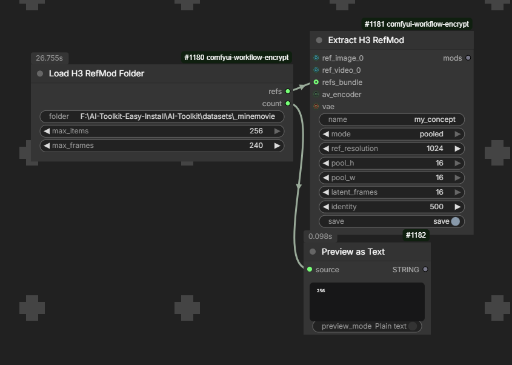

# ComfyUI-MiniMaxH3Mod

> 🚧 **Under construction** — API and node schemas are still evolving. Mods
> stay compatible, but expect node names/inputs to shift between versions.

## TL;DR (for the busy / new to this)

In MiniMax H3 you can give the AI a **reference** — an image, a video, even a
GIF — to tell it *"look like this"*. That's powerful, but every reference
gets loaded and processed every time you generate, which is slow and can
"bleed" its look into everything else in your video.

This pack lets you **save that reference once as a tiny `.safetensors` file**
(a "mod"), and then reuse it as many times as you want, whenever you want:

- **Save once** — take your image/video/GIF, hit *Extract*, and it becomes a
  small file on disk. No need to keep the original clip around or load it
  again.
- **Reuse anytime** — load the mod in one node, like picking a LoRA. Adjust
  how strong it is with a simple number (strength), or blend a few mods
  together (face + style + outfit, etc.).
- **No more heavy reference loading** — you can leave the H3 reference input
  **empty** and inject the mod through the conditioning instead. Faster
  generation, and the reference only affects what you want it to affect.
- **No training needed** — this is not a LoRA you train for hours; you just
  encode your reference and save it.

Scroll down to the **Examples (screenshots)** section to see the nodes in
action.

No-training **reference mods** for MiniMax H3 — the "fast LoRA" feel of H3's
ref2video multimodal input, without the heavy cost of injecting full videos or
training the model.

## Try it

A ready-made example mod ships in the repo: **`mods/vanellope_example.safetensors`**.
It appears as `vanellope_example` in the `Load H3 RefMods` dropdown after
install — plug it into `Apply H3 RefMod (Cond)` at strength 1.0 and prompt for
a candy racer in a karting scene.

## Install

1. **ComfyUI-MiniMaxH3** (required for the `av_encoder` input on Extract and
   the `Apply H3 RefMod` pack-conditioning node): ComfyUI Manager → search
   "MiniMax H3" → install, or clone into `custom_nodes/`:

   ```bash
   git clone https://github.com/kijai/ComfyUI-MiniMaxH3 custom_nodes/ComfyUI-MiniMaxH3
   ```

   Everything else (Extract with a plain `vae`, both loaders, the folder
   loader, and `Apply H3 RefMod (Cond)`) works without it. If it's missing,
   you get a one-line warning at startup and a clear error if you try to use
   `av_encoder`.
2. **This pack**: clone into `custom_nodes/` and restart ComfyUI. Python
   deps (`safetensors`, `numpy`, `Pillow`) are in `requirements.txt` and are
   installed automatically by ComfyUI Manager (or `pip install -r
   requirements.txt` manually). `opencv-python`/`imageio` are optional video
   backends for the folder loader.

Tested on Windows; `os.path`-based paths so it should work on Linux/Mac, but
only Windows has been exercised so far.

## The idea

H3's reference path works by injecting *reference tokens* into the packed
sequence: the ref is VAE-encoded, patchified, projected, and every DiT block
attends to those tokens. A video ref is heavy because it contributes
**thousands** of tokens (a 2048px ref image alone is ~4000 tokens per frame).

A RefMod is the same reference, saved to disk so you don't re-encode it:

1. `mode = full` — resize each ref to a target short edge (down only, like
   the official node) and encode with the H3 VAE. The stored latent is what
   the model attends to: at 1024px short edge that's ~1000 tokens per image
   frame, at 2048px ~4000.
2. `mode = pooled` — average-pool the latent to a small grid — 4×4 latent =
   **4 tokens**, with a couple of latent frames for motion (default 2),
   optionally refined with a few gradient steps that reconstruct the full
   latent (still model-free, seconds).

At generation time the latent is handed back through the **native `refs`
payload**, so it flows through the exact same per-block attention machinery
as a reference encoded live in the graph — full mode at strength 1.0 is
behaviorally the same ref the official node would inject.

This is the H3 analog of the LTX "Mod" adapter: where LTXMod uses trained
concept tokens + a hypernetwork predicting per-block AdaLN deltas, the H3
model's own cross-attention over the compressed ref tokens does the work, so
**no training and no 29B model load are needed**.

## Storage

Mods live in **`ComfyUI/models/refmods/`** — created on first run, next to
`loras/` and `unet/` — and are registered as a first-class model folder.
Extract and the CLI save there; the loader dropdowns read from there (and
still load mods saved by older versions in the pack's own `mods/` folder, so
your existing `VANELLOPE`/`tf2`/... files keep working).

## File format

A mod is one `.safetensors` with a JSON metadata block embedded in the
header. File size is not cosmetic — it tracks how much visual information
the ref carries:

- **`mode = full`** (default) stores the ref's full-resolution VAE encode:
  a 1024px short-edge image is a 64×64 latent = 24×64×64 fp16 values ≈
  **0.2 MB** per image frame. This is the mode that carries **identity** —
  the model was trained on full-res refs, and this is exactly what the
  official ref2video node injects (its 2048px "max" option exists
  specifically for "best identity fidelity").
- **`mode = pooled`** stores a tiny average-pooled grid (4×4, 2 frames =
  `24×2×4×4` ≈ 1.5 KB). Nearly free to inject, but a 4×4 latent is a
  8×8-pixel image — it carries concept/motion (colors, general look, a
  dance), not fine identity.

This is why tiny mods feel weak on characters: no amount of `strength` adds
information that isn't in the latent. Compare a LoRA's 100-400 MB, which
stores weight deltas for billions of parameters; a full RefMod stores the
actual encoded reference — a few hundred KB per image frame — which is the
honest cost of identity.

## Nodes (`MiniMax-H3/mod`)

| Node | What it does |
| --- | --- |
| `Extract H3 RefMod` | two typed Autogrow inputs — **`ref_image_1`** (stills) and **`ref_video_1`** (video frames) — each grows its own next slot → full-res or pooled latent, saved as `.safetensors` |
| `Load H3 RefMod Folder` | load every image/video in a folder as an ordered ref list → feed its `refs_bundle` into Extract for bulk extraction |
| `Load H3 RefMods` | one node, 1-8 mod dropdowns **with a typed strength each** (LoRA-loader style); `show_info` prints each mod's layout/token budget |
| `Load H3 RefMod Axis` | A/B mod pairs on one **signed slider** each — negative uses mod A, positive uses mod B (e.g. a young↔old age dial) |
| `Apply H3 RefMod` | append the bundle to a `MINIMAX_H3_COND` conditioning (ComfyUI-MiniMaxH3 pack) |
| `Apply H3 RefMod (Cond)` | same, for the built-in `CONDITIONING` type (`minimax_refs`) |

The old single loader, multi loader, Info, Compose and preset nodes are gone
— one loader with per-row strengths + a `show_info` toggle replaces them all.

### Reference strength (the honest math)

`strength` on each loader row (typed, 0-1) and `retention` on the Apply nodes
use the model's **own conditioning-strength mechanism**: weakening a ref mixes
its latent toward noise, exactly like the model's `visual_cond_noise_aug`
(`aug * z + (1 - aug) * noise`). Scaling latent values toward zero instead —
the old behavior — pushes them out of the normalized latent distribution, so
the model read them as grey patches: output greyed while identity never
actually faded.

- `1.0` = full reference (behaviorally the same ref the official node injects).
- Lower values fade identity smoothly toward "the model saw a noisy ref".
- `0` = the mod is not injected at all.
- `retention` on the Apply nodes is a typed master strength (0-1), so you
  can type any value. MiniMax's retention levels map to: 1.0 =
  `fully_preserved`, 0.7 = `partially_preserved`, 0.4 = `attribute_transfer`
  (keep the style/attributes, not the identity), 0.15 = `weak_reference`,
  0 = no reference.

### Concept axes (signed A/B sliders)

`Load H3 RefMod Axis` pairs an A-side mod and a B-side mod on **one signed
`value` slider** per row ([-1, 1]): negative values use the A mod, positive
values use the B mod, and the magnitude is the reference strength (same 0-1
math as the loader). A value of 0 skips the row. This makes an "age" dial
out of two extractions:

1. Extract a mod from your **young** refs (baby photos) and another from your
   **old** refs (elder man).
2. `Load H3 RefMod Axis`: `mod_a` = young mod, `mod_b` = old mod,
   `value = -0.6` → young at 60% strength, `value = +0.8` → old at 80%,
   `value = 0` → no age reference at all.

Same for any opposite pair: clean ↔ weathered, modern ↔ vintage, calm ↔
energetic. Rows are independent, so several axes can live in one node (up to
8), and the output feeds the same `Apply H3 RefMod (Cond)` nodes with the
same `retention` master control.

### Workflow

1. Load H3 as usual (`MiniMaxH3Loader` + VAE loader + encoder loader).
2. `Extract H3 RefMod`: plug **stills** into `ref_image_1` and **video
   frames** into `ref_video_1` (each input grows its own `_2`, `_3`...
   slots). The two types are tracked separately, so a multi-frame batch in
   a video slot is always a motion ref and a still slot is always a single
   frame. Connect `av_encoder` (or `vae`) and a name. Default `mode = pooled` with a
   16×16×16 grid and `identity = 500` — a good balance of identity vs token
   cost. `identity` is the dial that matters: higher clings to the refs
   (more detail, but sticks to their framing/background), lower deviates
   from the refs (more freedom, less detail), `0` = pure pooling. Switch
   `mode = full` when identity is paramount: it stores the real encode at
   `ref_resolution = 1024` short edge (down only, never upscaled); 2048 = 4×
   the tokens.
3. `Load H3 RefMods`: pick the mod from the dropdown and set its strength
   (new mods appear after a reload). Stack a whole character: face mod at
   1.0, a glitch/style mod at 0.4, a car/item mod at 1.0 — each row keeps
   its own strength, and the model attends to them side by side like a
   moodboard.
4. `Apply H3 RefMod (Cond)` between your conditioning node and the sampler,
   and type the `retention` strength (1.0 = fully preserved, down to 0 =
   no reference).

Works with `MiniMaxH3Conditioning`, `MiniMaxH3ReferenceToVideo`, and any
conditioning that carries refs/keyframes — the mod ref blocks are appended
to the existing ones.

## Examples (screenshots)

Real graphs from development, straight from the ComfyUI canvas.

### Extracting

An image and a video ref being extracted and fed into a conditioning node:


### Loading mods

`Load H3 RefMods` with several mods stacked (LoRA-loader style, one
strength per row):


### Loading a ref folder

`Load H3 RefMod Folder` pointed at an absolute path (a whole movie
dataset) — images + videos loaded in one shot, with the count shown in
the preview text:



### Bulk folder loading

`Load H3 RefMod Folder` reads every image (png/jpg/webp/bmp/gif) and video
(mp4/webm/mov/mkv/avi) in a folder — images first, then videos, by filename.
Type an absolute path, or a folder name inside ComfyUI's `input/` (empty =
`input/` itself). Feed its `refs_bundle` output into `Extract H3 RefMod` to
bulk-extract a whole character shoot in one go:

```
Load H3 RefMod Folder (folder: E:/vanellope_refs) ──refs_bundle──┐
                                                                  ├─ Extract H3 RefMod ─> vanellope.safetensors
ref_image_1 (hand-picked shots) ─────────────────────────────────┘
```

Bundle refs are appended after the autogrow refs, so `ref_image_1` still
anchors the canvas. Unreadable files are skipped with a note; `max_items`
caps the count and `max_frames` caps video length.

### Multi-ref concept mods (moodboards — near-LoRA style)

Every ref plugged into the Extract node is encoded independently and then
**stacked along the time axis** — each one becomes its own latent frame, so
different expressions, settings, angles, or a dance move stay distinct
instead of averaging into a blur. The model attends to the whole stack like
a short video ref. In `full` mode, videos are uniformly sampled to
`latent_frames` full-res frames; in `pooled` mode they are pooled to that
many frames. All refs share one spatial canvas (anchored on the first
ref), so mixed portrait/landscape refs stack cleanly — put your most
important framing first.

A character concept from a few photos of different expressions, plus one
video of them dancing:

```
ref_image_1 (face) ───────────┐
ref_image_2 (expression) ─────┤  Extract H3 RefMod ─> my_disney_char.safetensors
ref_image_3 (full body) ──────┤  (full, resolution 1024)
ref_video_1 (dance video) ────┘
```

Token budget at `full`/1024px: (n_images + n_video_frames) × ~1000.
4 refs → ~3000 tokens — comparable to a couple of official refs; the mod is
a few MB. At `pooled`/16×16: (n_images + n_video_frames) × 256 — a 4-ref
mod is ~1000 tokens with `identity` deciding how much of it survives.

## Standalone extraction (image/video files)

```bash
# full-res identity mod (default; recommended for characters)
python custom_nodes/ComfyUI-MiniMaxH3Mod/extract_mod.py \
    --image char.png \
    --vae path/to/h3_video_vae.safetensors \
    --name my_character --mode full --resolution 1024
```

```bash
# tiny concept/motion mod (pooled, 16x16x16, identity 500)
python custom_nodes/ComfyUI-MiniMaxH3Mod/extract_mod.py \
    --video dance.mp4 \
    --vae path/to/h3_video_vae.safetensors \
    --name dance --pool 16 --latent-frames 16 --identity 500
```

Options: `--mode full|pooled`, `--resolution` (full mode short edge),
`--pool` (pooled mode spatial grid, even), `--latent-frames`, `--identity`
(pooled-mode refinement steps; higher = clings to refs, lower = deviates),
`--output`, `--max-edge`, `--device`. Run it with the same Python that runs
ComfyUI (it imports `comfy` from the install it lives in). Video loading
uses opencv-python if available, otherwise imageio + imageio-ffmpeg.

Output: a **single** `models/refmods/<name>.safetensors` with the metadata
embedded in the file header — loadable by `Load H3 RefMods` and shareable on
CivitAI or similar as one file (no sidecar). Mods saved by older versions of
the pack (in `custom_nodes/ComfyUI-MiniMaxH3Mod/mods/` or with a sidecar
`.json`) still load fine.

## Notes

- The mod is visual-only (no audio refs). Audio refs still work from the
  regular reference nodes.
- Multi-ref mods use the video-kind layout; refs are ordered by slot number.
- `strength`/`retention` weaken refs with the model's native noise
  augmentation (see above); `1.0` = the full reference.
- `full` mode matches the official node's ref pipeline: resize down to the
  target short edge, encode, patchify — the model sees a ref at a
  resolution it was trained on. `pooled` keeps the area-normalized RoPE
  extent but at thumbnail resolution, so it reads as a downscaled
  reference.
- Old pooled mods (your `tf2`, `shakycam`, `minemovie`, `VANELLOPE`) still
  load fine; re-extract them in `full` mode for identity.

## License

[MIT](LICENSE) — © 2026 Luisa (luisacaotica).
